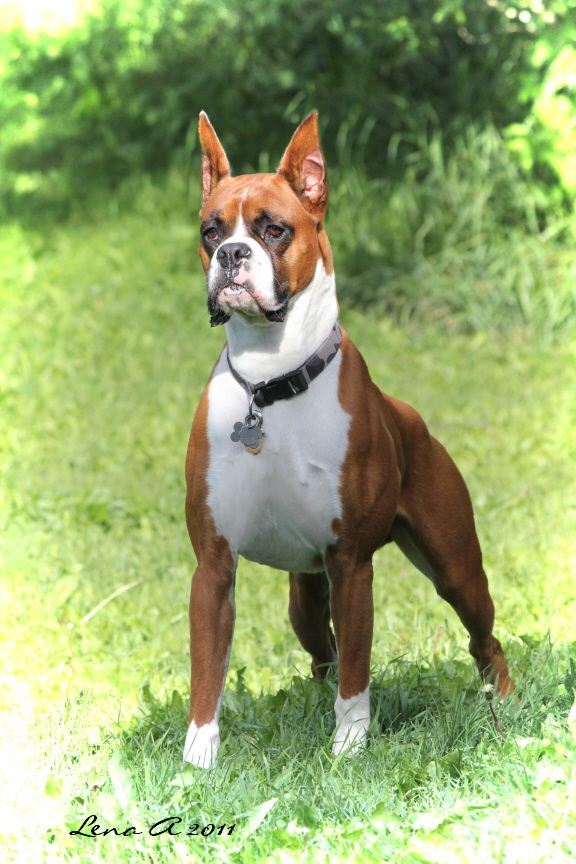
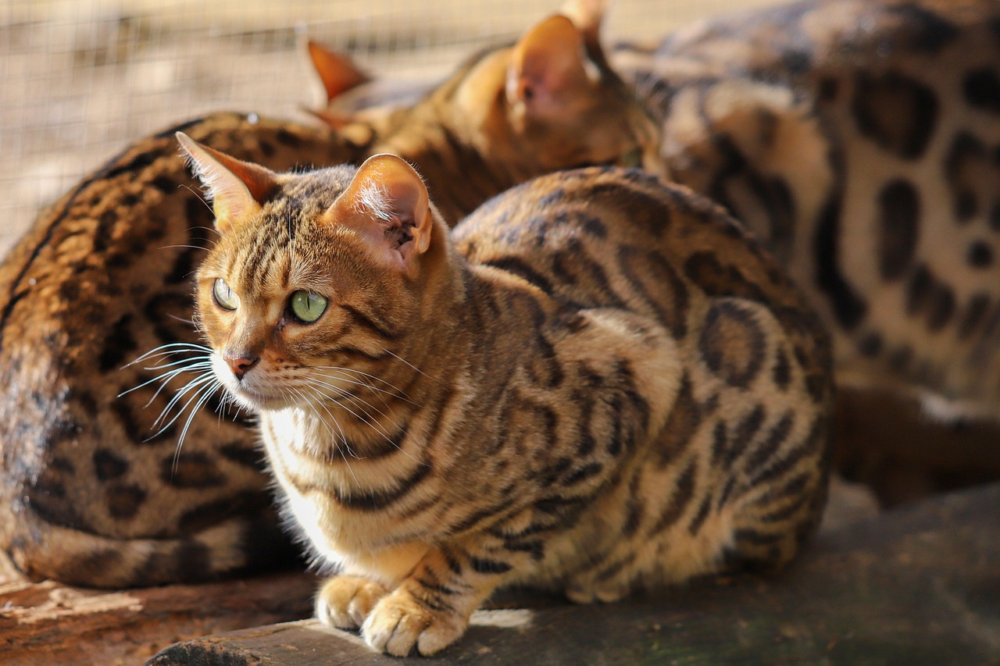
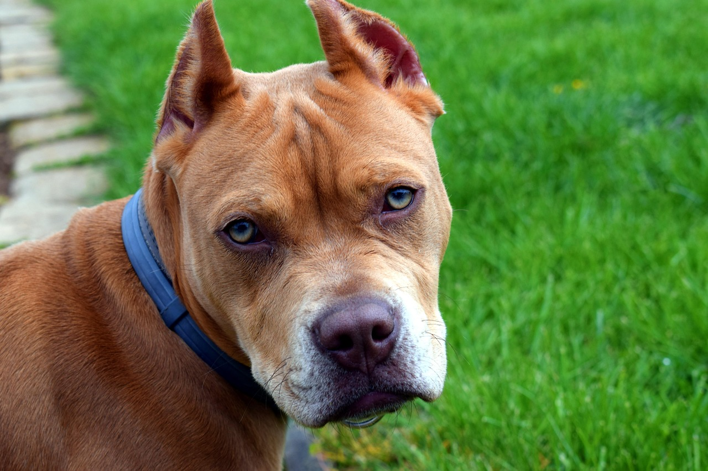

# 🐶🐱 Dog vs Cat Breed Classifier

> A deep learning–based image classification project that distinguishes between dogs and cats using **TensorFlow** and **MobileNetV2**. The model is trained on a Kaggle dataset and deployed with a simple **Streamlit** web app for real-time interaction.


---

### 📊 Model Statistics

| 📏 Input Size | 🏷️ Classes | 🎯 Top Confidence | 🧠 Architecture |
| :--- | :--- | :--- | :--- |
| **224² px** | **104 Categories** | **83% Accuracy** | **MobileNetV2** |

---

### ✦ Features

* 🔍 **Image Classification** – Identifies dogs and cats from any uploaded image.
* ⚡ **Transfer Learning** – Leverages pretrained MobileNetV2 weights for fast, accurate results.
* 🌐 **Interactive Streamlit UI** – Simple web interface — no code required to use.
* 📊 **Confidence Scores** – Returns a probability score alongside every prediction.

---

### 🧠 Model Details

| Attribute | Specification |
| :--- | :--- |
| **Architecture** | MobileNetV2 |
| **Framework** | TensorFlow / Keras |
| **Dataset** | Kaggle — Dogs and Cats Breed Classifier |
| **Input Shape** | 224 × 224 × 3 |
| **Output** | Multi-Class classification (softmax) |
| **Saved Format** | `.keras` (latest_model.keras) |

---

### 🏷️ Supported Breeds

<details>
<summary><b>🐱 View Cat Breeds (14)</b></summary>
<br>

> Abyssinian, American Shorthair, Bengal, Birman, Bombay, British Shorthair, Egyptian Mau, Maine Coon, Persian, Ragdoll, Russian Blue, Scottish Fold, Siamese, Sphynx.
</details>

<details>
<summary><b>🐶 View Dog Breeds (90)</b></summary>
<br>

> **A-C:** Afghan, African Wild Dog, Airedale, Akita, American Hairless, American Spaniel, Aspin, Basenji, Basset, Beagle, Bearded Collie, Bernese Mountain, Bichon Frise, Blenheim, Bloodhound, Bluetick, Border Collie, Borzoi, Boston Terrier, Boxer, Bull Mastiff, Bull Terrier, Bulldog, French Bulldog, Cairn, Cavalier King Charles Spaniel, Chihuahua, Chinese Crested, Chow, Clumber, Cockapoo, Cocker, Collie, Corgi, Coyote. 
> 
> **D-L:** Dachshund, Dalmatian, Dhole, Dingo, Doberman Pinscher, Elk Hound, Flat-Coated Retriever, German Shepherd, Golden Retriever, Great Dane, Great Pyrenees, Greyhound, Groenendael, Havanese, Irish Spaniel, Irish Wolfhound, Japanese Spaniel, Komondor, Labradoodle, Labrador Retriever, Lhasa. 
> 
> **M-Z:** Malinois, Maltese, Mexican Hairless, Miniature Schnauzer, Newfoundland, Pekinese, Pit Bull, Pomeranian, Poodle, Pug, Rhodesian, Rottweiler, Saint Bernard, Schnauzer, Scotch Terrier, Shar Pei, Shetland Sheepdog, Shiba Inu, Shih-Tzu, Siberian Husky, Vizsla, Yorkie.
</details>

---

### 🧪 Sample Predictions

| Prediction: Dog (Boxer) | Prediction: Cat (Bengal) | Prediction: Dog (Pitbull) |
| :--- | :--- | :--- |
| `test_images/dog1.jpg` | `test_images/cat1.jpg` | `test_images/dog2.jpg` |
|  |  |  |
| **Confidence: 97%** | **Confidence: 99%** | **Confidence: 79%** |
| `██████████ 97%` | `██████████ 99%` | `██████████ 79%` |

---

### 📂 Project Structure

* 🐍 **`app.py`** — Streamlit web app
* 📓 **`animal-classify.ipynb`** — Model training notebook
* 💾 **`latest_model.keras`** — Trained model file
* 🖼️ **`test_images/`** — Sample images for demo
* 📄 **`README.md`** — Project documentation

---

### ⚙️ Installation

```bash
# 1. Clone the repository
git clone https://github.com/imperiorhackers9934/dog-cat-classifier.git

# 2. Enter the directory
cd dog-cat-classifier

# 3. Install dependencies
pip install -r requirements.txt

# 4. Launch the web interface
streamlit run app.py
```

---

### 🔮 Future Improvements

- [ ] **Multi-breed classification** – Expanding beyond the current 104 classes.
- [ ] **Mobile app deployment** – Real-world portable usage.
- [ ] **TFLite Optimization** – Making the model faster for edge devices.
- [ ] **Dataset Expansion** – Increasing training data for higher accuracy.

---

### 🙌 Acknowledgements

`TensorFlow & Keras` • `Kaggle Dataset Contributors` • `Streamlit` • `MIT License`

---
**Made with ❤️ by [imperiorhackers9934](https://github.com/imperiorhackers9934)**